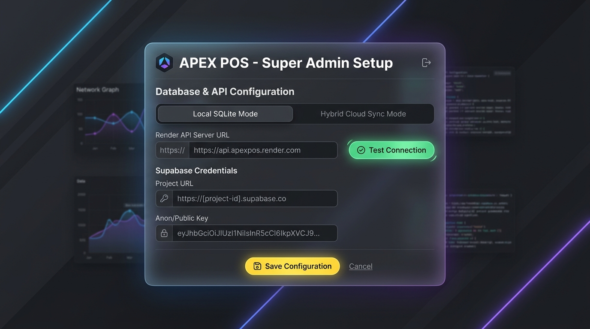

# Instrucciones de Compilación y Configuración Dinámica de Escritorio (Single-Tenant)

## Diseño Visual del Onboarding (Pantalla de Activación)

### Opción 1: Conexión Híbrida / Local (Supabase Directo)


### Opción 2: Conexión Nube Directa (Render API Server)


Esta guía documenta los requerimientos e implementaciones para la transición del POS "Apex POS" a un instalador nativo de escritorio (Windows/macOS) utilizando Electron o Tauri bajo un modelo Single-Tenant con inyección dinámica de credenciales.

---

## 1. Concepto y Arquitectura

En un modelo Single-Tenant o multi-sucursal, tenemos dos componentes principales que pueden configurarse dinámicamente en caliente:

1. **El Servidor de la API (Alojado en Vercel, Render o Local)**: 
   * La aplicación de escritorio (frontend) no se conecta a Supabase directamente, sino que hace peticiones HTTP a la **URL del Servidor API** (ej: `https://mi-servidor.vercel.app` o `https://mi-servidor.onrender.com`).
   * Por lo tanto, el Onboarding debe registrar la **URL del Servidor API** en `localStorage` (bajo la clave `pos_api_base_url`) para redirigir el tráfico.
2. **La Base de Datos Supabase**:
   * Las llaves de Supabase (`supabase_url` y `supabase_anon_key`) son utilizadas por el **servidor API backend** para conectarse a la base de datos PostgreSQL.
   * Si el servidor API corre de forma local en la máquina del cliente, la interfaz gráfica del setup recopilará las claves de Supabase locales para configurar el backend local.

De esta manera, el flujo de activación puede configurar tanto la **URL del Servidor API (Vercel/Render)** como las **Credenciales de Supabase** según el modo de instalación.

### 1.1 Protección de Acceso por Llave Maestra (Master Key) y Dongle Alternativo
> [!IMPORTANT]
> **Seguridad de Inicialización**:
> Dado que en el primer arranque de la aplicación la base de datos **no está conectada**, no es posible autenticar al Super Admin contra los usuarios de la base de datos de PostgreSQL (como `Admin` o `Dorian`).
> 
> Para solucionar esto, el desbloqueo del formulario de configuración aceptará **dos métodos alternativos**:
> 
> 1. **Método A: Contraseña Master Key**: Introducir manualmente la clave maestra local estática establecida: **`APEX2401`**.
> 2. **Método B: Dongle USB de Licencia Digital**: Insertar una memoria USB autorizada que contenga el archivo criptográfico `apex_license.key`.
>    * **Funcionamiento**: Electron leerá el número de serie de hardware único de fábrica de la memoria USB conectada.
>    * **Validación**: Desencriptará el archivo de licencia utilizando la clave pública incrustada y verificará que el número de serie codificado coincida exactamente con el de la memoria física. Si coincide, la pantalla de configuración se desbloqueará de forma automática sin necesidad de escribir la clave.
>    * **Anti-clonado**: Si el archivo de licencia es copiado a otra memoria USB física, la validación fallará porque el número de serie de hardware de la nueva memoria diferirá del grabado en la firma digital.
> 
> Ambos métodos son válidos para ingresar inicialmente al Setup o para realizar modificaciones de red y base de datos posteriores en la terminal activa.

---

## 2. Componente de Almacenamiento Local (`ConfigManager`)
Servicio encargado de leer y guardar la configuración del proyecto localmente de manera síncrona/asíncrona.

```typescript
// apps/pos-desktop/src/services/ConfigManager.ts
export const ConfigManager = {
  getCredentials() {
    const url = localStorage.getItem('supabase_url');
    const anonKey = localStorage.getItem('supabase_anon_key');
    return { url, anonKey };
  },

  setCredentials(url: string, anonKey: string) {
    localStorage.setItem('supabase_url', url);
    localStorage.setItem('supabase_anon_key', anonKey);
  },

  clearCredentials() {
    localStorage.removeItem('supabase_url');
    localStorage.removeItem('supabase_anon_key');
  },

  hasCredentials(): boolean {
    const { url, anonKey } = this.getCredentials();
    return !!(url && anonKey);
  }
};
```

---

## 3. Cliente Dinámico de Supabase (`supabaseClient`)
Módulo encargado de instanciar y retornar la conexión cliente a Supabase utilizando las llaves provistas en caliente.

```typescript
// apps/pos-desktop/src/services/supabaseClient.ts
import { createClient } from '@supabase/supabase-js';
import { ConfigManager } from './ConfigManager';

let supabaseInstance: any = null;

export function getSupabase() {
  if (supabaseInstance) return supabaseInstance;

  const { url, anonKey } = ConfigManager.getCredentials();
  if (!url || !anonKey) {
    throw new Error('Supabase no inicializado. Faltan credenciales locales.');
  }

  supabaseInstance = createClient(url, anonKey);
  return supabaseInstance;
}

// Resetear la instancia en caliente al guardar nuevas credenciales
export function resetSupabaseInstance() {
  supabaseInstance = null;
}
```

---

## 4. Pantalla de Activación (`SetupScreen.tsx`)
Componente GUI de configuración inicial para validar y almacenar los parámetros de Supabase.

```tsx
// apps/pos-desktop/src/components/SetupScreen.tsx
import React, { useState } from 'react';
import { createClient } from '@supabase/supabase-js';
import { ConfigManager } from '../services/ConfigManager';
import { resetSupabaseInstance } from '../services/supabaseClient';

interface SetupScreenProps {
  onSuccess: () => void;
}

export default function SetupScreen({ onSuccess }: SetupScreenProps) {
  const [url, setUrl] = useState('');
  const [anonKey, setAnonKey] = useState('');
  const [error, setError] = useState('');
  const [isValidating, setIsValidating] = useState(false);

  const handleSave = async (e: React.FormEvent) => {
    e.preventDefault();
    setError('');
    setIsValidating(true);

    if (!url.trim() || !anonKey.trim()) {
      setError('Todos los campos son requeridos.');
      setIsValidating(false);
      return;
    }

    try {
      // 1. Probar conexión básica (ping a la API del proyecto Supabase)
      const testClient = createClient(url.trim(), anonKey.trim());
      const { data, error: pingError } = await testClient.from('Producto').select('count', { count: 'exact', head: true });

      if (pingError) throw new Error(pingError.message);

      // 2. Guardar credenciales si el ping fue exitoso
      ConfigManager.setCredentials(url.trim(), anonKey.trim());
      resetSupabaseInstance(); // Invalidar instancia anterior en memoria

      onSuccess();
    } catch (err: any) {
      console.error('Fallo de validación de conexión:', err);
      setError(`No se pudo conectar a Supabase: ${err.message || 'Verifique las llaves'}`);
    } finally {
      setIsValidating(false);
    }
  };

  return (
    <div className="fixed inset-0 z-50 flex items-center justify-center bg-slate-950 text-slate-100 font-sans">
      <div className="w-full max-w-md bg-slate-900 border border-slate-800 rounded-2xl p-8 shadow-2xl">
        <h2 className="text-2xl font-black tracking-tight text-white mb-2">Activación de Terminal</h2>
        <p className="text-sm text-slate-400 mb-6">
          Ingrese las credenciales de conexión del servidor Supabase para aprovisionar esta máquina.
        </p>

        {error && (
          <div className="bg-rose-500/10 border border-rose-500/20 text-rose-400 p-4 rounded-xl text-xs font-semibold mb-6">
            ⚠️ {error}
          </div>
        )}

        <form onSubmit={handleSave} className="space-y-4">
          <div>
            <label className="block text-xs font-bold uppercase tracking-wider text-slate-400 mb-2">
              Supabase Project URL
            </label>
            <input 
              type="url" 
              placeholder="https://xxxx.supabase.co" 
              className="w-full bg-slate-950 border border-slate-800 rounded-xl py-3 px-4 text-sm text-white outline-none focus:border-amber-500 transition-colors"
              value={url}
              onChange={(e) => setUrl(e.target.value)}
              required
            />
          </div>

          <div>
            <label className="block text-xs font-bold uppercase tracking-wider text-slate-400 mb-2">
              Supabase Anon Key
            </label>
            <textarea 
              rows={4}
              placeholder="eyJhbGciOi..." 
              className="w-full bg-slate-950 border border-slate-800 rounded-xl py-3 px-4 text-sm text-white outline-none focus:border-amber-500 transition-colors font-mono resize-none"
              value={anonKey}
              onChange={(e) => setAnonKey(e.target.value)}
              required
            />
          </div>

          <button 
            type="submit" 
            disabled={isValidating}
            className="w-full mt-6 bg-amber-500 hover:bg-amber-400 disabled:bg-slate-800 text-slate-950 font-black py-4 rounded-xl shadow-lg transition-all active:scale-[0.98]"
          >
            {isValidating ? 'Validando conexión...' : 'ACTIVAR SOFTWARE'}
          </button>
        </form>
      </div>
    </div>
  );
}
```

---

## 5. Integración en el Punto de Entrada Principal (`main.tsx` o `App.tsx`)
Intercepta el arranque normal de la app y decide si mostrar la terminal de ventas o forzar la pantalla de activación.

```tsx
import React, { useState } from 'react';
import ReactDOM from 'react-dom/client';
import POSInterface from './POSInterface';
import SetupScreen from './components/SetupScreen';
import { ConfigManager } from './services/ConfigManager';
import './index.css';

function AppRoot() {
  // Estado local para forzar actualización de vista una vez activado
  const [isActivated, setIsActivated] = useState(() => ConfigManager.hasCredentials());

  if (!isActivated) {
    return <SetupScreen onSuccess={() => setIsActivated(true)} />;
  }

  return <POSInterface />;
}

ReactDOM.createRoot(document.getElementById('root')!).render(
  <React.StrictMode>
    <AppRoot />
  </React.StrictMode>
);

---

## 6. Especificaciones de Licenciamiento y Modo Demo Local Restringido

### 6.1 Restricciones del Modo Demo
Por defecto, la base de datos local SQLite inicia en estado **no activado (demo)**, aplicando las siguientes reglas de negocio:
1.  **Límite de Catálogo**: Máximo **200 artículos** en total.
2.  **Límite de Usuarios**: Máximo **3 usuarios** registrados (Ej: `Admin + Admin + Admin` o `Admin + Gerente + Vendedor`).
3.  **Límite de Dispositivos**: 1 sola impresora física conectada, 0 vendedores móviles, y 0 terminales clientes adicionales (operación monopuesto).
4.  **Módulos Bloqueados**: Cotizaciones, Proveedores, CRM Clientes, Antigüedad de Saldos y Facturación CFDI.
5.  **Límite Temporal**: 1 año de prueba activa.
    *   **Alerta de Expiración**: Se mostrará una barra de advertencia amarilla en la cabecera únicamente cuando resten **30 días o menos** para concluir el periodo de prueba.

### 6.2 Widget de Activación en Pantalla de PIN (Login)
Para permitir el aprovisionamiento de la licencia:
1.  En la pantalla de ingreso de PIN de la Caja Principal (Server), se muestra el **Hardware ID (UUID + MAC)**.
2.  Se proporciona un botón rápido para copiar el ID o enviarlo directamente a soporte (WhatsApp/Email).
3.  Se añaden campos de entrada para **Email del Cliente** y **License Key (Licencia)**.
4.  Si los campos están vacíos, el usuario ingresa simplemente con su PIN y opera en modo Demo.

### 6.3 Acceso Oculto al Setup Super Admin (Híbrido)
Para configurar las llaves de Supabase + Render en el Server, el panel se mantiene invisible usando exclusivamente dos métodos de entrada:
1.  **Vía A - Atajo de Teclado**: Presionar `Ctrl + Shift + A` (Windows) o `Cmd + Shift + A` (macOS) en la pantalla de PIN de login abre una ventana flotante pidiendo la contraseña maestra (**`APEX2401`**).
2.  **Vía B - Dongle USB Físico**: Al insertar una memoria USB con el archivo criptográfico `apex_superadmin.key`, Electron detecta el dispositivo y abre directamente la pantalla de configuración híbrida (sin escribir contraseñas).


```
